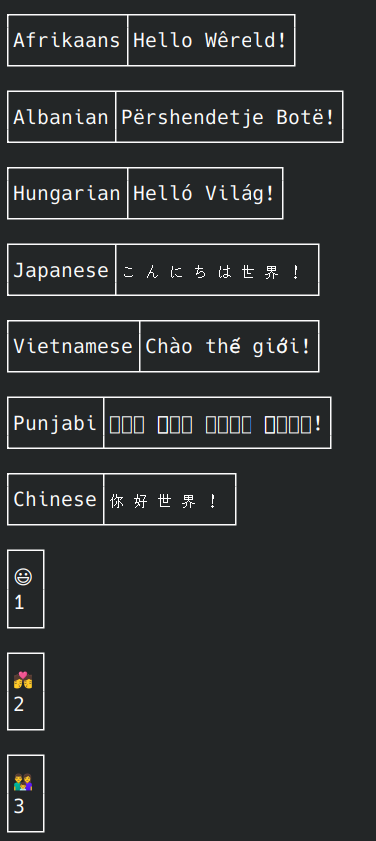
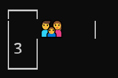

# Console pretty printer for tabulated data

**Pretty** is a very lightweight cross-platform C++20 library for pretty formatting and pretty printing tabular data to the standard output of the program.

**Tags**: *C++ pretty table, print table in C++, table formatting, tabulated output, console output, pretty formatting*.

## How to use

### Visual Studio, projects and solutions

The library was tested with Visual C++/Visual Studio Version 17.5.1:

1. Copy `unicode.ixx`, `pretty-impl.ixx`, `pretty.ixx` to your project, include them as **Existing Item**s.
2. Compile the files as module interface files. In Visual Studio, go to file **Properties**, `Property Pages` > `C/C++` > `Advanced`, set `Compile As` to `Compile as C++ Module Code (/interface )` for all the three files.
3. Go to project **Properties**, `Property Pages` > `General`, set `C++ Language Standard` to `Standard  ISO C++20 Standard (/std:c++20)`.
4. Go to project **Properties**, `Property Pages` > `C/C++` > `Command Line`. In `Additional Options`, add

	```
	/utf-8
	```
	
5. You are ready to use the API.

### Clang

The library was tested with clang version 15.0.7:

1. Copy `unicode.ixx`, `pretty-impl.ixx`, `pretty.ixx` to your project directory.
2. Go to your project directory:

	```
	cd <your_project_dir>
	```
3. The following command prebuilds the library modules:

	``` 
	clang++-15 -std=c++20 -Wall -O3 -fprebuilt-module-path=. -xc++-module unicode.ixx pretty-impl.ixx pretty.ixx --precompile
	```
4. The following command builds a console test program for the library:

	```
	clang++-15 -std=c++20 -Wall -O3 -s -fprebuilt-module-path=. main.cpp unicode.pcm pretty-impl.pcm pretty.pcm
	```
	`main.cpp` in the command above is taken from the library and contains tests.
5. You are ready to use the API.

### GCC
GCC C++ versions 11,12,13 were all tried. Versions 12 and 13 were unable to build the project due to internal compiler errors. Version 11 required to introduce some weird changes to the source code and to stop using some unsupported features like `module:private`, after which GCC managed to build an executable. The executable crashed with a segmentation fault at startup, without printing anything. This section will be updated when GCC catches up.

### CMake

CMake support for C++20 modules is very experimental and is not ready production.

The library provides a temporary CMake-compatible solution without C++20 modules, `pretty.cpp` and `pretty.h`. The support for these files will be dropped in the future in favor of modules. 

`pretty/Impl/CMakeLists.txt` builds the library as an object file. 

`pretty/tests/CMakeLists.txt` builds tests.

Successfully tested with

* Clang 15.0.7, Linux x64
* GCC 12.2.1, Linux x64
* Visual Studio 17.5.3, Windows 10 x64

If you want to use CMake with Visual Studio, use the [built-in Visual Studio support for CMake](https://learn.microsoft.com/en-us/cpp/build/cmake-projects-in-visual-studio)

On Linux, an easy way to use CMake is via `Visual Studio Code` with `C/C++ Extension Pack` and `CMake Tools` extensions. A C++ compiler and `ninja` need to be installed separately in a way specific to your Linux distribution.

## API

*All the detailed examples from this section can be found in `main.cpp`.*

Import module `pretty`:

```cpp
import pretty;
```

and you are ready to use the API.

### How to populate tables with data
Instantiate `pretty::Table` and call its functions. `pretty::Table` can grow at runtime by appending new rows and/or columns in any order. It is possible to add some rows first, then some columns to the rows, then again rows:

```cpp
const auto table = pretty::Table()
			.addRow("r1")
			.addRow("r2")
			.addCol({ "c1", "c2" })
			.addRow("r3", "r3");
```
The code above produces the following table:

```
┌────┬────┐
│ r1 │ c1 │
│ r2 │ c2 │
│ r3 │ r3 │
└────┴────┘
```

`pretty::Table` supports only regular tables - the number of columns is the same in each row. 

When adding new rows, it is important to make sure that the number of columns in appended row[s] matches the current number of columns in the table. 

When adding new columns, it is important to make sure that the number of rows in appended column[s] matches the current number of rows in the table. 

`addRow(…)` is overloaded and accepts either `std::vector<std::string>` or a variadic pack of arguments convertible to `std::string`.

`addCol(…)` accepts only `std::vector<std::string>`.

`addColumns(ColN numCols)` and `addRows(RowN numRows)` allow to add the given number of empty columns and rows, respectively. The added cells are empty and need to be populated programmatically by calling 
`setText(RowN row, ColN col, std::convertible_to<std::string> auto&& text)`:

```cpp
auto table = pretty::Table()
			.addColumns(3)
			.addRows(2);

auto format = [](pretty::RowN r, pretty::ColN c)
{
	return std::to_string(r.val()) + "," + std::to_string(c.val());
};

pretty::RowN r{};
for (; r < table.numRows(); ++r)
	for (pretty::ColN c{}; c < table.numColumns(); ++c)
		table.setText(r, c, format(r, c));
```

The above code produces:

```
┌─────┬─────┬─────┐
│ 0,0 │ 0,1 │ 0,2 │
│ 1,0 │ 1,1 │ 1,2 │
└─────┴─────┴─────┘
```


Now let's add 3 additional rows to the previous table:

```cpp
table.addRows(3);
for (;r < table.numRows(); ++r)
    for (pretty::ColN c{};c < table.numColumns(); ++c)
        table.setText(r, c, format(r, c));
```

which produces:

```
┌─────┬─────┬─────┐
│ 0,0 │ 0,1 │ 0,2 │
│ 1,0 │ 1,1 │ 1,2 │
│ 2,0 │ 2,1 │ 2,2 │
│ 3,0 │ 3,1 │ 3,2 │
│ 4,0 │ 4,1 │ 4,2 │
└─────┴─────┴─────┘
```


### How to format and print tables
Instantiate `pretty::Printer` and configure it as required:
```cpp
pretty::Printer print;
```

#### Frame styles

**Basic**

```cpp
print.frame(pretty::FrameStyle::Basic);
```

```
+----------------+-----------+
| Country        | UN Region |
+----------------+-----------+
| World          | -         |
| United States  | Americas  |
| China          | Asia      |
| Japan          | Asia      |
| Germany        | Europe    |
| India          | Asia      |
| United Kingdom | Europe    |
| France         | Europe    |
+----------------+-----------+
```

**Line**

```cpp
print.frame(pretty::FrameStyle::Line);
```

```
┌────────────────┬───────────┐
│ Country        │ UN Region │
├────────────────┼───────────┤
│ World          │ -         │
│ United States  │ Americas  │
│ China          │ Asia      │
│ Japan          │ Asia      │
│ Germany        │ Europe    │
│ India          │ Asia      │
│ United Kingdom │ Europe    │
│ France         │ Europe    │
└────────────────┴───────────┘
```

**LineRounded**

```cpp
print.frame(pretty::FrameStyle::LineRounded);
```

```
╭────────────────┬───────────╮
│ Country        │ UN Region │
├────────────────┼───────────┤
│ World          │ -         │
│ United States  │ Americas  │
│ China          │ Asia      │
│ Japan          │ Asia      │
│ Germany        │ Europe    │
│ India          │ Asia      │
│ United Kingdom │ Europe    │
│ France         │ Europe    │
╰────────────────┴───────────╯
```

**ThickLine**

```cpp
print.frame(pretty::FrameStyle::ThickLine);
```

```
┏━━━━━━━━━━━━━━━━┳━━━━━━━━━━━┓
┃ Country        ┃ UN Region ┃
┣━━━━━━━━━━━━━━━━╋━━━━━━━━━━━┫
┃ World          ┃ -         ┃
┃ United States  ┃ Americas  ┃
┃ China          ┃ Asia      ┃
┃ Japan          ┃ Asia      ┃
┃ Germany        ┃ Europe    ┃
┃ India          ┃ Asia      ┃
┃ United Kingdom ┃ Europe    ┃
┃ France         ┃ Europe    ┃
┗━━━━━━━━━━━━━━━━┻━━━━━━━━━━━┛
```

**DoubleLine**

```cpp
print.frame(pretty::FrameStyle::DoubleLine);
```

```
╔════════════════╦═══════════╗
║ Country        ║ UN Region ║
╠════════════════╬═══════════╣
║ World          ║ -         ║
║ United States  ║ Americas  ║
║ China          ║ Asia      ║
║ Japan          ║ Asia      ║
║ Germany        ║ Europe    ║
║ India          ║ Asia      ║
║ United Kingdom ║ Europe    ║
║ France         ║ Europe    ║
╚════════════════╩═══════════╝
```

**Minimal**

```cpp
print.frame(pretty::FrameStyle::Minimal);
```

```
  Country          UN Region
 ---------------- -----------
  World            -
  United States    Americas
  China            Asia
  Japan            Asia
  Germany          Europe
  India            Asia
  United Kingdom   Europe
  France           Europe
```

#### Padding
`padding(n)` allows to set the horizontal distance from the text to the cell border:

```cpp
print.padding(0);
```

```
┌──────────────┬─────────┐
│Country       │UN Region│
├──────────────┼─────────┤
│World         │-        │
│United States │Americas │
│China         │Asia     │
│Japan         │Asia     │
│Germany       │Europe   │
│India         │Asia     │
│United Kingdom│Europe   │
│France        │Europe   │
└──────────────┴─────────┘
```

#### Header separator
`headerSeparator(bool show)` shows or hides horizontal separator line for the first row ("header"). Otherwise, the header row does not differ from other rows:

```cpp
print.headerSeparator(false);           
```

```
┌──────────────┬─────────┐
│Country       │UN Region│
│World         │-        │
│United States │Americas │
│China         │Asia     │
│Japan         │Asia     │
│Germany       │Europe   │
│India         │Asia     │
│United Kingdom│Europe   │
│France        │Europe   │
└──────────────┴─────────┘
```

#### Printer output
Once `pretty::Printer` is configured, call `[[nodiscard]]std::string toString(const Table& t) const` to obtain a string with a pretty-formatted table.

If you need to print to the standard output, the `operator<<` is overloaded for `pretty::Printer`:

```cpp
pretty::Printer print;
print.frame(pretty::FrameStyle::Basic);
cout << print(table);
```

`pretty::Printer` also overloads the `operator()` to allow the concise syntax for data loading like in the code above.

On Windows, printing to the standard output requires enabling UTF8 for the console, which is done by the overloaded `operator<<`. Otherwise, you may just use `toString(...)` and then manually print the obtained string to whatever stream/file you need.


#### Unicode
The library is fully Unicode-aware. The data in all cells is of type `std::string` which is expected to be encoded in UTF8. When formatting the table, `pretty::Printer` takes into account the visible/display/column width of cell text, so tables are correctly formatted even with hieroglyphs and emojis:



For correct Unicode rendering it is important that:

1. The used OS and terminal application support Unicode
2. The selected terminal font supports Unicode and all the codepoints that you need to print

On Linux, hieroglyphic and emoji codepoints are rendered much better. 

On Windows, using Windows Terminal is highly recommended, as `cmd.exe` does not support rendering some codepoints even after enabling UTF8 and selecting a Unicode font, see https://stackoverflow.com/a/67510140. Windows Terminal renders many emojis correctly


, but not all:



Report issues at [Windows Terminal](https://github.com/microsoft/terminal)
